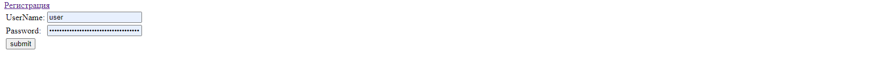
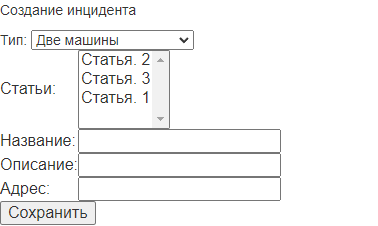

# car_accident
1. В системе существуют две роли. Обычные пользователи и автоинспекторы.
   Пользователь добавляет описание автонарушение. В заявлении указывает: адрес
   , номер машины, описание нарушения и фотографию нарушения.
   У заявки есть статус: принята, отклонена, завершена. Главная страница - это поиск с таблицей.

2. Spring MVC
3. Spring core (DI, IoC)
4. Spring JDBC
5. Spring Hibernate
6. Spring Data JPA
7. Spring Security

# регистрация

# Все проишествия

# Создание нового проишествия

